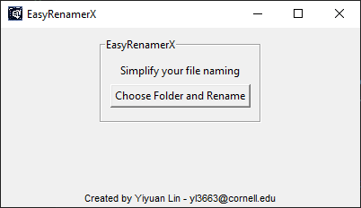

# EasyRenamerX

Author: [Yiyuan Lin](yl3663@cornell.edu)


EasyRenamerX is a powerful yet simple tool designed to help you organize your files by renaming them according to a standardized naming convention. It replaces spaces with underscores, capitalizes the first letter of each word except prepositions, and ensures your file names are clean and consistent.



This repository contains two versions of EasyRenamerX:
- A command-line version for those who prefer script-based interaction.
- A GUI version for a more user-friendly experience.

Additionally, a Windows executable file is provided for ease of use without the need for Python installation.


## Features

- **Space to Underscore Conversion**: Automatically replaces spaces with underscores in file and folder names.
- **Selective Capitalization**: Capitalizes the first letter of each word except for prepositions, providing a more readable and standardized format.
- **Recursive Renaming**: Works through the specified directory, including all subdirectories and files, ensuring a comprehensive renaming process.
- **Customizable Directory Selection**: Allows users to specify the target directory or defaults to the directory where the script is located.


## Installation

To use EasyRenamerX with command line or GUI via python script, you need Python installed on your system. The script is compatible with Python 3.x versions. Clone or download this repository to your local machine to get started.

```bash
git clone https://github.com/YiyuanLinXX/EasyRenamerX.git
cd EasyRenamerX
```

No additional Python packages are required to run this script.

To use the Windows executable program, directly download the .exe file and run it without any other installation.


## Usage

### 1. Command-Line Version

To run EasyRenamerX, navigate to the script's directory in your terminal or command prompt, and execute the following command:

```bash
cd EasyRenamerX
python EasyRenamerX.py --root_dir 'path/to/your/directory'
```

**NOTE: If you do not specify the `--root_dir` argument, the script will default to renaming files and folders in the script's current directory.**


### 2. EasyRenamerX_GUI

Simply run the script, and a window will open allowing you to select the directory to rename files and folders:

```bash
cd EasyRenamerX
python EasyRenamerX_GUI.py
```


### 3. Windows Executable(.exe)

For Windows users, a standalone executable is available, eliminating the need for Python installation.

Double-click `EasyRenamerX_GUI.exe` to launch the application and start organizing your files with just a few clicks.


## Limitations

- The script does not undo the renaming operation. Ensure you have backups or are sure about proceeding with the renaming.
- Customizing prepositions or additional naming rules in terminal or interactive interface is not supported in the current version, but you can modify the code with your specific rules.


## Contributing

Contributions to EasyRenamerX are welcome. Please feel free to fork the repository, make changes, and submit pull requests. If you encounter any issues or have suggestions for improvements, please open an issue in the repository.